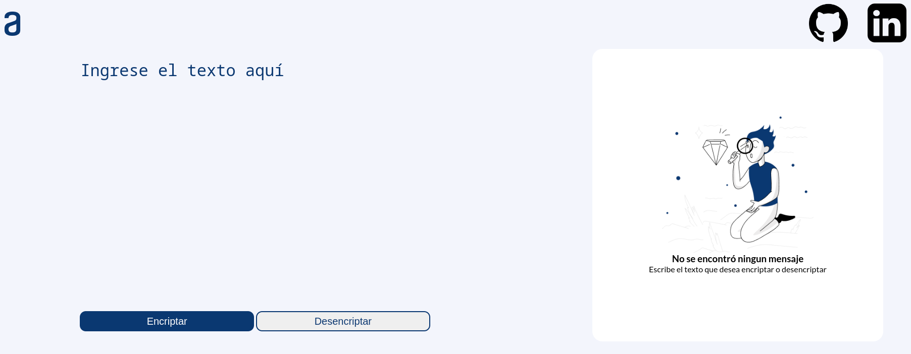

# **ENCRIPTADOR DE TEXTO - ALURA CHALLENGES ONE**

## 💻 **DESARROLLO** 

### **Objetivo:** 

Desarrollar una aplicación que encripta textos, para intercambiar mensajes secretos con otras personas.

Las "llaves" de encriptación utilizadas son las siguientes:

- La letra "e" es convertida para "enter" 
- La letra "i" es convertida para "imes" 
- La letra "a" es convertida para "ai" 
- La letra "o" es convertida para "ober" 
- La letra "u" es convertida para "ufat" 

Por ejemplo: 
- "gato" => "gaitober" 
- gaitober" => "gato"

### **Herramientas de desarrollo:**

    

### **Herramientas de diseño y gestión:**

?node-id=0-1&t=5ehZduWq4aW4qtns-0)  
  

### **Mensaje secreto!**

Desencripta nuestro mensaje secreto!

>fenterlimescimesdaidenters poberr enternfrenterntair enterstenter dentersaifimesober y haibenterrlober cobernclufatimesdober cobern enterximestober!
 

## ✅ **CONCLUIDO**

### **Imagen:**

### **Enlace:**

&emsp;&emsp; [GitHub Pages: Encriptador](https://asgarynt.github.io/alura-challenge-01-encrypter/)

### **Mensaje secreto desencriptado**

>felicidades por enfrentar este desafio y haberlo concluido con exito!
